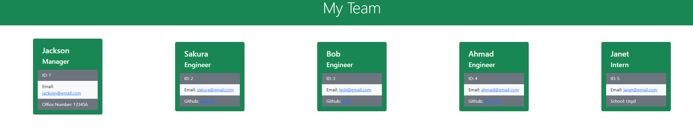

# Team Profile Generator

## Table of Contents
  - [Description](#description)
  - [Installation](#installation)
  - [Usage](#usage)
  - [Demo](#demo)

## Description
This application is an HTML generator that collets data from the command line. The data it collects relates to the programming team of the user. It will prompt the user with a series of questions, the responses of which can be used to create a webpage.

## Installation
To install this application, simply download the repository using your desired method:
1. Run 'git clone' with the SSH link in your command line.
2. Download the zip file by clicking on the green 'code' button then clicking 'download zip'.

## Usage
To use this application, open your preferred command line application, navigate to where folder in which 'index.js' is located and run the command 'node index.js'. Following that, simply answer the questions prompted by the application and your HTML file will be generated once you answer 'None'.

## Demo

You can also view the demo in video form <a href='https://watch.screencastify.com/v/j12k30Un3pwOC2DjpCfc'>here</a>.

Here is a sample image of what will show once all desired data has been entered:

